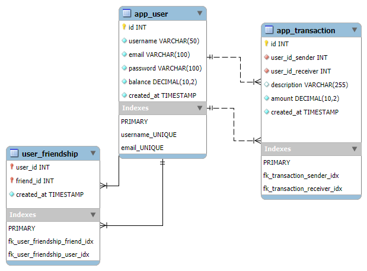

# Pay My Buddy

Application web Java avec Spring Boot permettant aux utilisateurs d'envoyer des paiements sécurisés à leurs amis

---

## Table des matières

- [Description](#description)
- [Objectifs](#objectifs)
- [Architecture](#architecture)
- [Technologies utilisées](#technologies-utilisées)
- [Installation](#installation)
- [Base de données](#base-de-données)
- [Fonctionnalités](#fonctionnalités)
- [Améliorations futures](#améliorations-futures)

---

## Description

**Pay My Buddy** est une application web Java développée avec **Spring Boot** permettant aux utilisateurs d'envoyer des paiements sécurisés à leurs amis.

Elle permet notamment :
- La gestion d'un compte utilisateur et de ses informations personnelles (nom d'utilisateur, mot de passe).
- L'ajout de nouveaux amis à partir de leur adresse email.
- L'envoi d'argent sécurisé à ses amis.
- Le suivi détaillé des transactions financières.

L’application est conçue selon une architecture **Spring MVC** :
- Les vues sont générées côté serveur avec **Thymeleaf**.
- Les contrôleurs gèrent les requêtes HTTP et préparent les données pour les vues Thymeleaf.
- La logique métier est encapsulée dans les services, qui sont appelés par les contrôleurs.
- L'application génère les pages HTML côté serveur avec **Thymeleaf** via Spring MVC, ce n’est donc pas une API REST renvoyant du JSON.

Ce projet comprend également :
1. **Une base de données relationnelle** conçue à partir d'un Modèle Physique de Données (MPD) optimisé et sécurisé.
2. **Une application web** avec couche d'accès aux données (DAL), logique métier et interface utilisateur inspirée des maquettes Figma fournies.


---

## Objectifs

- Concevoir et implémenter une base de données sécurisée.
- Développer une application web avec **Java / Spring Boot**.
- Mettre en place la gestion des transactions financières.
- Respecter les bonnes pratiques d'ergonomie, d'accessibilité (WCAG) et de sécurité.

---

## Architecture

L'application est organisée en plusieurs couches :

- **Controller** : Gestion des requêtes HTTP et communication avec la couche service.
- **Service** : Contient la logique métier.
- **Repository / DAL** : Gestion des accès et requêtes vers la base de données.
- **Model** : Entités JPA représentant les tables de la base de données.

---

## Technologies utilisées

- **Java 21**
- **Spring Boot** (Web, Data JPA, Security)
- **Maven** pour la gestion des dépendances
- **MySQL** comme BDD
- **Thymeleaf** pour le rendu côté serveur
- **Git** pour le versionning
- **JUnit 5** / **Mockito** / **Spring Boot Test** pour les tests unitaires et les tests d'intégration
- **Jacoco** pour la couverture de code
- **Logback** pour la journalisation

---

## Installation

1. **Cloner le projet**
   ```bash
   git clone https://github.com/suebdh/PayMyBuddyAPIWeb.git
   cd PayMyBuddyAPIWeb 

2. **Installer les dépendances Maven**
    ```bash
    mvn clean install

## Configuration

1. **Créer la base de données MySQL**

    - **Méthode 1** : Lancer le script SQL (par exemple via MySQL Workbench ou en ligne de commande) pour créer la base et les tables :
      ```bash
      mysql -u root -p < src/main/resources/script/schema.sql
      ```

    - **Méthode 2** : Directement depuis MySQL
      ```sql
      CREATE DATABASE paymybuddy;
      USE paymybuddy;
      source src/main/resources/script/schema.sql
      ```

2. **Configurer les identifiants dans src/main/resources/application.properties**

   Important : Créer deux variables d'environnement système DB_USERNAME et DB_PASSWORD avant de lancer l'application
   - DB_USERNAME : le nom d'utilisateur MySQL
   - DB_PASSWORD : le mot de passe MySQL
      ```properties
      spring.datasource.url=jdbc:mysql://localhost:3306/paymybuddy?serverTimezone=UTC
      spring.datasource.username=${DB_USERNAME}
      spring.datasource.password=${DB_PASSWORD}
      spring.jpa.properties.hibernate.dialect = org.hibernate.dialect.MySQLDialect
      spring.jpa.hibernate.ddl-auto=update
      spring.jpa.show-sql=true

3. **Lancer l'application**
    ```bash
    mvn spring-boot:run

4. **Accéder à l'application**
   
   - URL : http://localhost:8080 (port de l'application web Spring Boot)
   - Port MySQL : 3306 (pour la base de données)

## Base de données

Le **Modèle Physique de Données (MPD)** définit la structure des principales tables et les relations utilisées par
l'application **Pay My Buddy**.

### Tables principales

- **`app_user`** : Stocke les informations des utilisateurs (nom d'utilisateur, email, mot de passe chiffré, solde, date de création).
- **`app_transaction`** : Historique des transactions effectuées et reçues (expéditeur, destinataire, description, montant, date de
  création).
- **`user_friendship`** : Liste des relations d'amitié enregistrées entre les utilisateurs.

### Diagramme EER

Le schéma ci-dessous illustre les tables et leurs relations dans la base de données :



> **Note :**
> - Diagramme généré à partir de **MySQL Workbench**.
> - Le fichier source est disponible dans `docs/EER_PayMyBuddy.mwb` pour modification si nécessaire.
> - Ce diagramme pourra être mis à jour en fonction des évolutions du modèle.

### Création de la base de données

Créez le schéma de la base de données MySQL à l'aide du fichier :
[script SQL](src/main/resources/scripts/schema.sql)

## Scénario Utilisateur

Un utilisateur peut :

1. Créer un compte et se connecter à l'application de manière sécurisée.
2. Mettre à jour son profil.
3. Rechercher et ajouter des amis via leur adresse email.
4. Effectuer un transfert d'argent vers l'un de ses amis et voir son solde se mettre à jour.
5. Consulter l'historique détaillé de toutes ses transactions (paiements envoyés et reçus).

## Fonctionnalités

- Authentification sécurisée
- Gestion des utilisateurs
- Gestion des amis
- Envoi et réception de paiements
- Suivi du solde
- Historique détaillé des transactions

## API Endpoints

| Method                          | URL         | Paramèters                                   | Description & Details                                                     |
|---------------------------------|-------------|----------------------------------------------|---------------------------------------------------------------------------|
| GET                             | `/register` |                                              | affiche le formulaire d'inscription                                       |
| POST                            | `/register` | `username, email, password`                  | crée un nouvel utilisateur                                                |
| GET                             | `/login`    |                                              | affiche le formulaire de connexion un utilisateur                         |
| POST                            | `/login`    | `username, password`                         | authentifie l'utilisateur (Spring Security)                               |
| POST                            | `/logout`   |                                              | déconnecte l'utilisateur                                                  |
| GET                             | `/profil`   | -                                            | affiche le profil de l'utilisateur connecté                               |
| POST                            | `/profil`   | `username et/ou password `                   | met à jour le profil (username, mot de passe)                             |
| GET                             | `/relation` |                                              | affiche le formulaire d'ajout d'ami                                       |
| POST                            | `/relation` | `email`                                      | ajoute un ami par email                                                   |
| GET                             | `/transfer` | -                                            | affiche la page de transfer (liste des amis, historique des transactions) |
| POST(en cours d'implémentation) | `/transfer` | `UsernameDestinataire, description, montant` | envoie de l'argent à un ami                                               |


## Améliorations futures

- Interface responsive
- Notifications (email / push) pour les paiements
- Export de l'historique en PDF ou CSV
- Support multi-devises
- Supprimer un ami
- Intégration avec des passerelles de paiement externes (ex : Stripe, PayPal, SEPA) pour connecter les transferts internes à des transactions financières réelles
- Re-factorisation des endpoints en API REST (JSON) pour usage par un frontend ou mobile app
- Gestion avancée des comptes utilisateurs :
  - Compte non activé après inscription (activation par email)
  - Compte suspendu ou désactivé par un administrateur
  - Compte expiré (ex : abonnements temporaires)